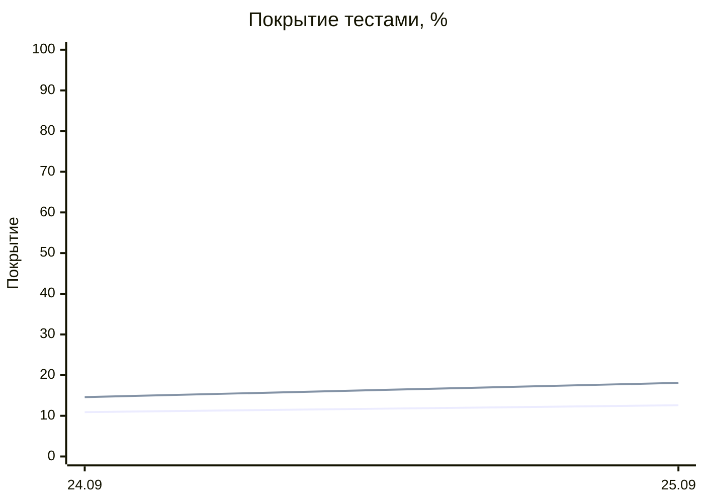

# Studio2Prod — отчёты покрытия тестами

Этот репозиторий автоматически публикует статический HTML-отчёт о покрытии тестами проекта [Studio2Prod](https://github.com/EvgeniBondarev/Studio2Prod).

## Актуальная сводка

<!-- COVERAGE_DASHBOARD:START -->
## Текущая метрика

| Метрика | Значение |
| --- | ---: |
| Line coverage | **12.6%** (36603 из 290446) |
| Branch coverage | **18.1%** (16983 из 93363) |
| Сборки / классы / файлы | 5 / 2722 / 1981 |
| Период измерения | 09/25/2026 - 07:28:05 - 09/25/2026 - 07:31:13 |

## Динамика покрытия

_Первая линия — строки, вторая — ветви. Хранится до 90 последних измерений._
<!-- COVERAGE_DASHBOARD:END -->

## Открыть подробный HTML-отчёт

[Перейти к актуальному отчёту покрытия](https://evgenibondarev.github.io/coverage-report/report/)

Сводка и график обновляются ежедневно после ночного CI-прогона ветки [`local-deploy`](https://github.com/EvgeniBondarev/Studio2Prod/tree/local-deploy). Полный HTML-отчёт доступен по ссылке выше.

## Что внутри

- покрытие строк и ветвей по производственным сборкам;
- разбивка по модулям, классам и исходным файлам;
- список участков с высоким риском и низким покрытием.

HTML-отчёт собирается инструментами Coverlet и ReportGenerator. Исходный код Studio2Prod и тесты остаются в приватном репозитории; здесь размещается только готовая статическая визуализация метрик.

## Ссылки

- [Исходный проект Studio2Prod](https://github.com/EvgeniBondarev/Studio2Prod)
- [CI/CD и исходный workflow](https://github.com/EvgeniBondarev/Studio2Prod/actions)
- [Документация о покрытии](https://github.com/EvgeniBondarev/Studio2Prod/blob/local-deploy/docs/test-coverage.md)
